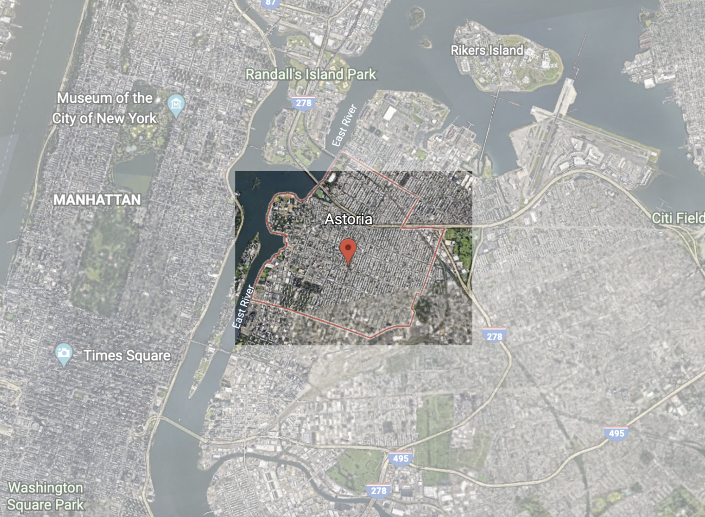
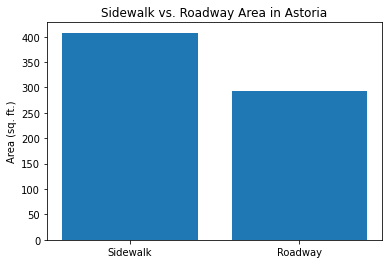
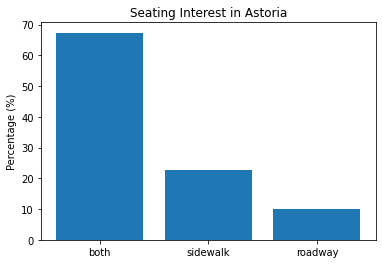

By Yulin Zheng

## Where is Astoria?

## Demographics and Statistics

ZIP Codes: 11101, 11102, 11103, 11105, 11106

Astoria is a neighborhood on the west side of Queens named after John Jacob Astor. In total, the population of Astoria is 171,781 and the population is spread pretty evenly between the ZIP Codes. In terms of racial makeup, the largest percentage in each ZIP Code is white and in ZIP Codes 11103 and 11105 they are a majority, although a small one. In all neighborhoods, Asian and Hispanics make up the largest percentage of minority groups, with their size being roughly the same. The median income of Astoria ranges from $75,581 to $68,530. 
Astoria is a neighborhood with great diversity in restaurants as many immigrants have settled there over the years. For example, it is well-known for its Greek cuisine (map pictured below) which has historical roots. According to The New York Times, although Astoria is home to many immigrants, many leave, with a recent example being the Bengali community in the early 2000s. Still though, Astoria still has people from hundreds of different countries and its culinary selection reflects that.

## Observations and Analysis for Queens

In order to determine how each of our Queens neighborhoods ranked in terms of desirability for outdoor dining, we compared each one using the following desirable qualities: walk score, transit score, and income. Walk Score measures how readily the residents of a neighborhood can access the restaurants. People walking around the neighborhood could spot the restaurants and decide to stay and eat. Transit Score measures how readily consumers outside the neighborhood can access the restaurants. People need to be able to access the restaurants easily if they hear about them through advertisements. Income  is used to determine the cost of living. This then indicates more opportunities for restaurants to operate and be supported. We first ranked each neighborhood by a criteria and awarded 1 to 5 points (5 being the best and 1 being the worst). Then we totaled the points to determine a final ranking. For all metrics, walk score, transit score and median income, the higher the number is, the more points each neighborhood received. In terms of desirability of outdoor dining, our metrics indicate the following for our respective neighborhoods in Queens (from best to worst): Ridgewood, Jackson Heights, Astoria, Maspeth, Flushing. Ridgewood has the best balance of walkability, train access, and income to create an environment ideal for people to start restaurants that have outdoor dining while being easily accessible to people in and out of the area.
\

## In-Depth Astoria Analysis

\
In the neighborhood of Astoria, the bar graph shows that the average sidewalk area is greater than the average roadway area. 

\
Based on the bar graph, the neighborhood of Astoria prefers sidewalks compared to roadways for seating for outdoor dining.  

## Map of Restaurants in Astoria
<dl>
<iframe src="astoria.html" width="600" height="400" frameborder="0" frameborder="0" marginwidth="0" marginheight="0" allowfullscreen></iframe>
</dl>
